# [Class 7.5 - installation walkthrough (WIP)](https://docs.google.com/document/d/10fDf4KzM_wglVJeTZzeJ2DiJ40gYX32lAubteQ9a-T8/edit?tab=t.0#heading=h.dbj957a6wnz9)

Theo University - Class 7.5 / SEIR-1 (GCP, March 2026)

---

# Table of Contents

- [Prerequisites Setup](#prerequisites-setup)
- [Verify Tool Installation](#verify-tool-installation)
- [3) Google Cloud Console](#3-google-cloud-platform)
- [Create Your First Project](#create-your-first-project)
- [Enable GCP Services API](#enable-gcp-services-api)
- [Create Price Alerts](#create-price-alerts)
- [Create a Service Account](#create-a-service-account)
- [Grant This Service Account Access to Project](#grant-this-service-account-access-to-project)
- [Create Keys for Service Account](#create-keys-for-service-account)
- [Deliverable 1](#deliverable-1)
- [4) GCP CLI](#4-gcp-cli)
- [Deliverable 2](#deliverable-2)
- [5) Creating an instance](#5-creating-an-instance)
- [Deliverable 3](#deliverable-3)
- [6) Teardown](#6-teardown)


---

# Prerequisites Setup

For Mac run:

```bash
curl https://raw.githubusercontent.com/rofoed01/scripts_homebrew/refs/heads/main/brew_install_SEIR-1.command | sh
```

Takes a while, let it set up.


Check and see if there were any errors. Log locations for the Windows and Mac installs are below.

Mac = Users/**YOUR USERNAME**/Documents/TheoWAF/Logs


<sub>[Back to top](#table-of-contents)</sub>

---

# Verify Tool Installation

Open the command line tool for your machine and run the below commands to ensure everything is working.

1. `python --version`
   - did not install with the provided code
   - run `brew install python`

The problem is Apple removed the python command and only supports python3 so check with:

```bash
python3 --version
```

2. `terraform --version`

3. `gcloud version`


<sub>[Back to top](#table-of-contents)</sub>

---

# 3. [Google Cloud Platform](https://console.cloud.google.com/)

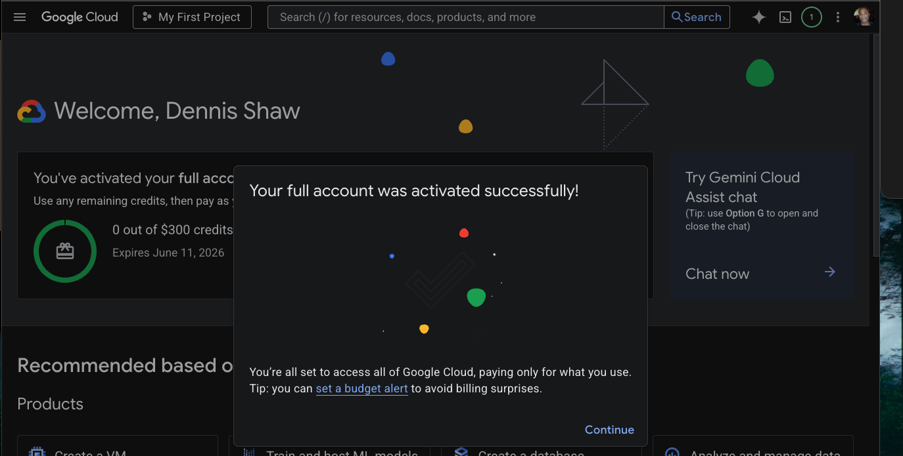

---

# Create Your First Project

Click this link:

https://console.cloud.google.com/projectcreate

Give your project a unique name, like:

- TheoWAF-class7.5-insertYourNameHere
- class75-myNameHere

Example:

class7.5_iLoveDanksDimples

Click **Create**


<sub>[Back to top](#table-of-contents)</sub>

---

# Enable GCP Services API

In the search bar, type in **Compute Engine** and click on **VM Instances**

You’ll then be presented with a screen asking you to enable the service.

Click **Enable**

If prompted for a billing account:

- select your recently created billing account
- click **Set Account**

After that wait a minute or two for the process to finish.

Make sure you are signed into the correct Google account or billing/project owner account.

### Make sure you are signed into the same Google account that created the project.

### In the top project selector confirm you selected the correct project:


Enable and wait a couple minutes for the process to finish.


<sub>[Back to top](#table-of-contents)</sub>

---

# Create Price Alerts

Search bar → **Budgets & Alerts**

Click **Create Budget**

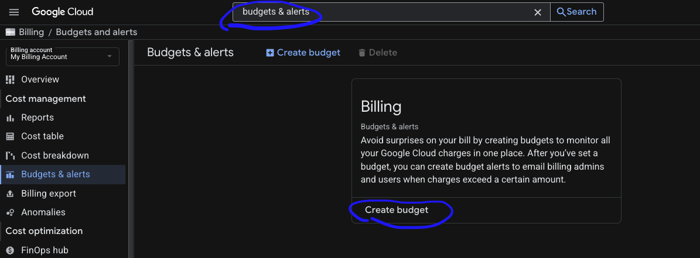

## Scope

Name

Class 7.5 Budget

Time range

Monthly

Leave all other options as default.

Click **Next**

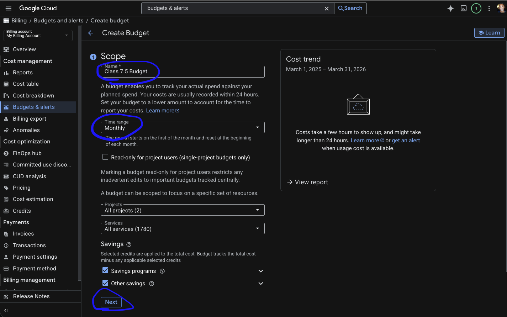

<sub>[Back to top](#table-of-contents)</sub>

---

## Amount

Budget type

Specified amount

Target amount

$5

Amount can be whatever you want to spend.

Click **Next**


<sub>[Back to top](#table-of-contents)</sub>

---

## Actions

Customize alerts to your preference.

Click **Finish**

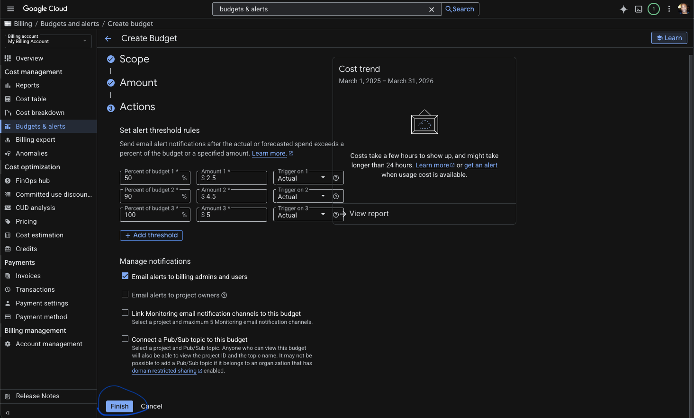

<sub>[Back to top](#table-of-contents)</sub>

---

# Create a Service Account

Search bar → **Service Accounts**

Select your desired project for the service account.

*(You will need to create a service account for every project you want to have.)*

Click **Create Service Account**

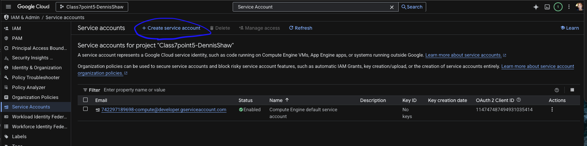

<sub>[Back to top](#table-of-contents)</sub>

---

## Service Account Details

Service account name

terraform-service

Service account ID will automatically generate (do not edit this)

Service account description

terraform service account for (insert project name here)

Click **Create and Continue**


<sub>[Back to top](#table-of-contents)</sub>

---

# Grant This Service Account Access to Project

Click on the **email link**

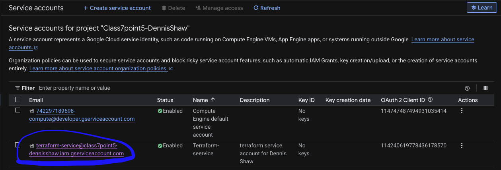

Permissions tab → Manage Access (side window opens)

Click the Role box and type:

Owner

Click **Add another role** and add:

- Storage Admin
- Artifact Registry Administrator

Click **Save**


~~Grant users access to this service account  
Click done~~

<sub>[Back to top](#table-of-contents)</sub>

---

# Create Keys for Service Account

Go back to the service account page.

Select the row.

Under the **Actions** column on the far right click the **3 vertical dots**.

Select **Manage Keys**


Click:

Add key → Create New Key


In the popup window make sure **JSON** is selected and click **Create**

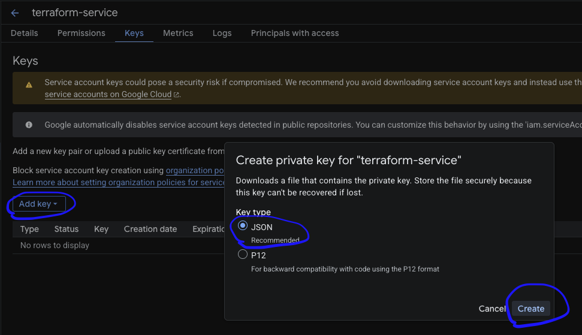

The key is now saved to your computer.

Move the key to your Terraform folder:

Documents/TheoWAF/class7.5/GCP/Terraform
<sub>[Back to top](#table-of-contents)</sub>

---

# Deliverable 1

Take and submit a screenshot of your Terraform service account `.json` file once you have moved it to the above file path.

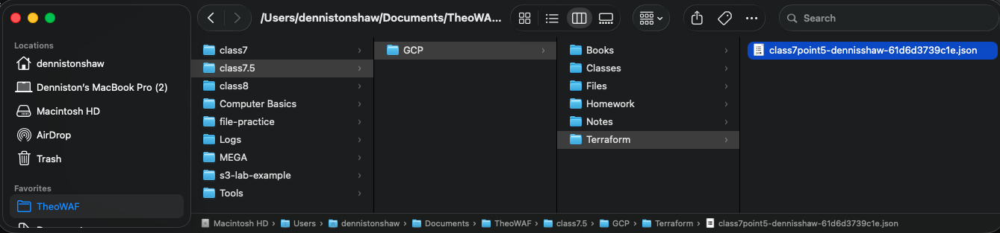

<sub>[Back to top](#table-of-contents)</sub>

---

# 4. GCP CLI

a. **Official sources (for reference)**
- [Google SDK instructions](https://cloud.google.com/sdk/docs/install-sdk)
- [Gcloud “getting started” guide](https://codelabs.developers.google.com/codelabs/cloud-shell#0) 

b. **Preliminary setup (have you done these steps?)**
- Sign into [GCP](https://console.cloud.google.com) with your personal Gmail account
- Chocolatey / Homebrew installs from above, or installing the GCP SDK from [here](https://cloud.google.com/sdk/docs/install-sdk)

d **Windows users**

c **Mac / Linux users**
- Initialize gcloud
  - Open the terminal
  - Type the following command:

run
```bash
gcloud init
```

  - From there, the shell will open a browser window, prompting you to sign in with the Gmail account used for GCP
  - After doing this, you’ll then be prompted to set up some account defaults; you can accept the defaults for the time being.
  - Choose your desired project (one will have a random name, but show up as “My First Project” in the GUI)
  - When prompted to set a default region, say “N”


It will:
- Open a browser login
- Ask which Google account to use
- Ask which project to set as default
- Choose your project:
  - 1
Do you want to configure a default Compute Region and Zone? (Y/n)?
  - Y
Which Google Compute Engine zone would you like to use as project default?
  - us-east1
  - 
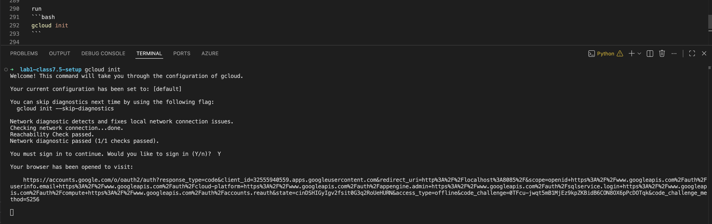


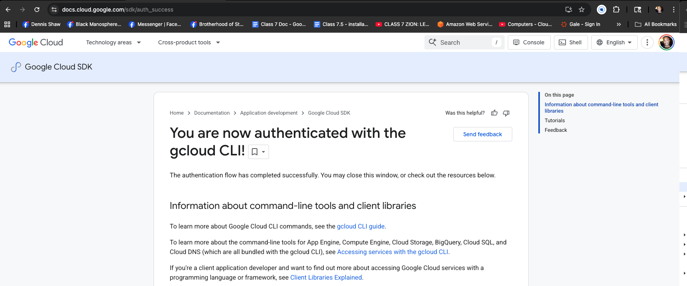


```bash
gcloud components update
```

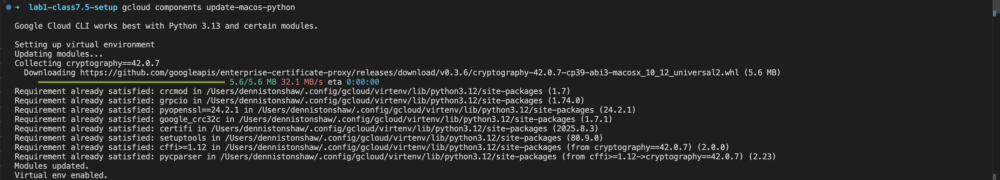

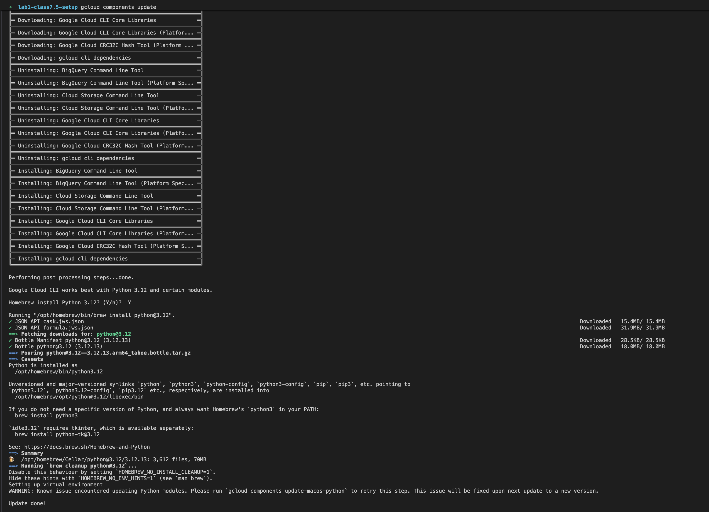


```bash
gcloud info
```

<sub>[Back to top](#table-of-contents)</sub>

---

# Deliverable 2

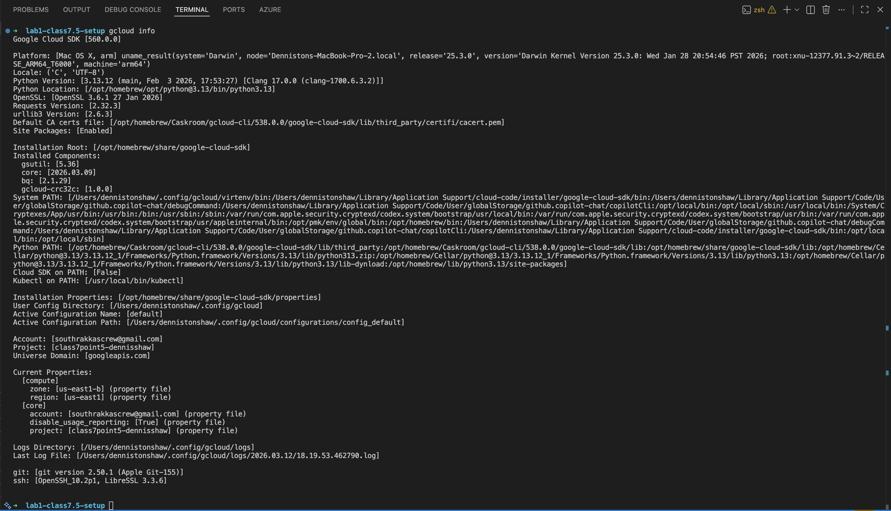

<sub>[Back to top](#table-of-contents)</sub>

---

# 5) Creating an instance

1. After creating your Google Cloud account go to https://console.cloud.google.com/
don't use My First Project (looks unprofessional). Go to the project you created


2. Create a VM
- click the box or search for Create VM in the search box at the top


3. see the menu on the left hand side:
- note: don't click create until the end after you've gone through all the section's changes (1-7)

#### 1. Machine configuration (no changes)
  


#### 2. OS and Storage (no changes)
#### 3. Data Protection (select No backups)


#### 4. Network  
- check Allow HTTP

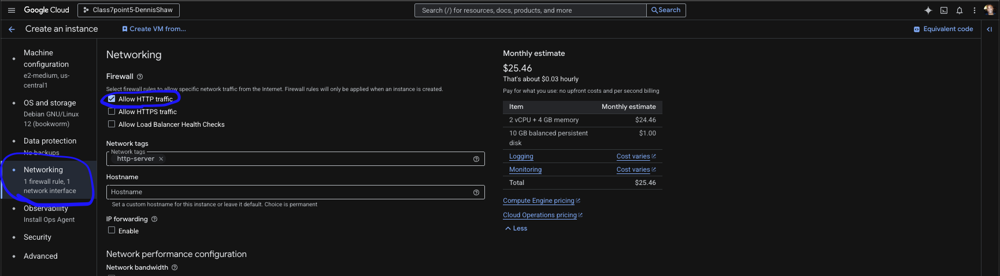

#### 5. Observability (no changes)
#### 6. Securtity (no changes)
#### 7. Advanced
- copy [Startup script](https://github.com/BalericaAI/SEIR-1/blob/main/weekly_lessons/weeka/userscripts/basic.sh) (user data) and paste it in Automation box 

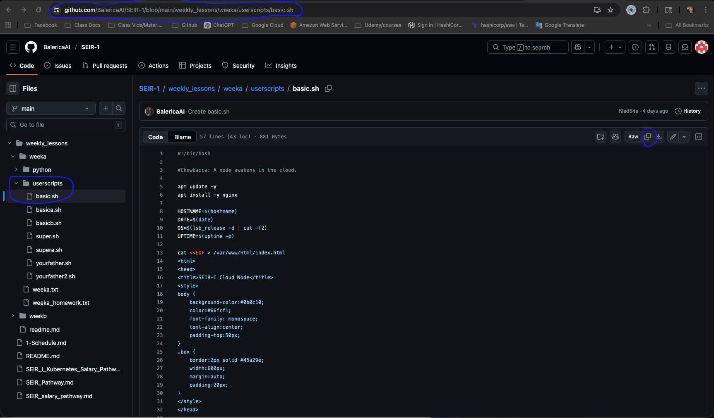

click - Create
 
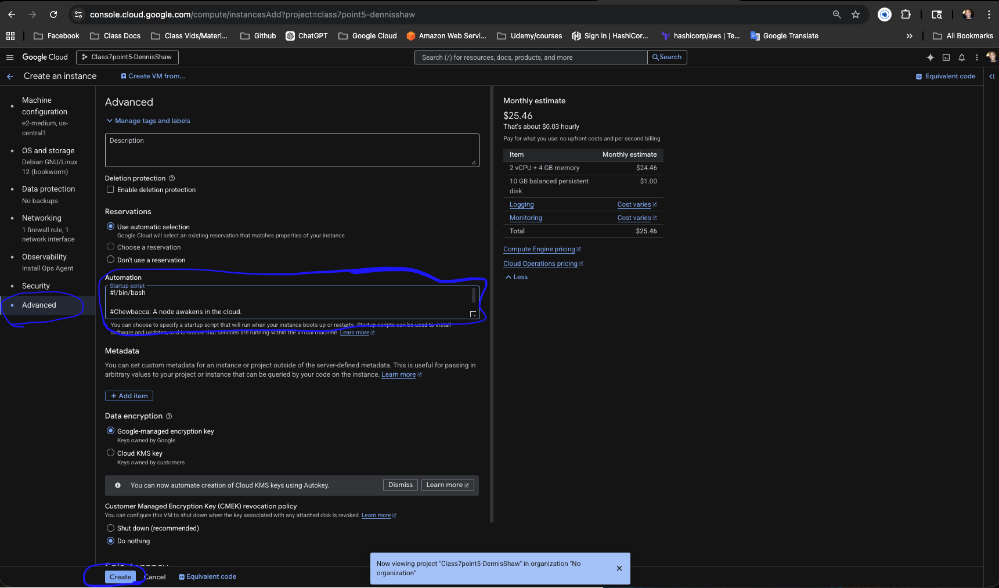

#### Verify it works
- copy the External IP add "http://" example http://136.112.135.44

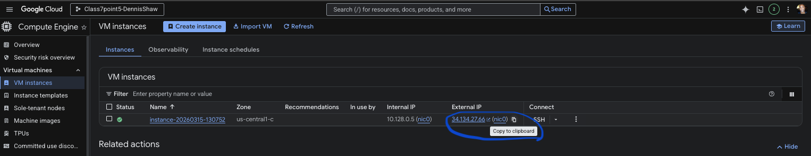

- paste into your browser to verify

<sub>[Back to top](#table-of-contents)</sub>

---

# Deliverable 3

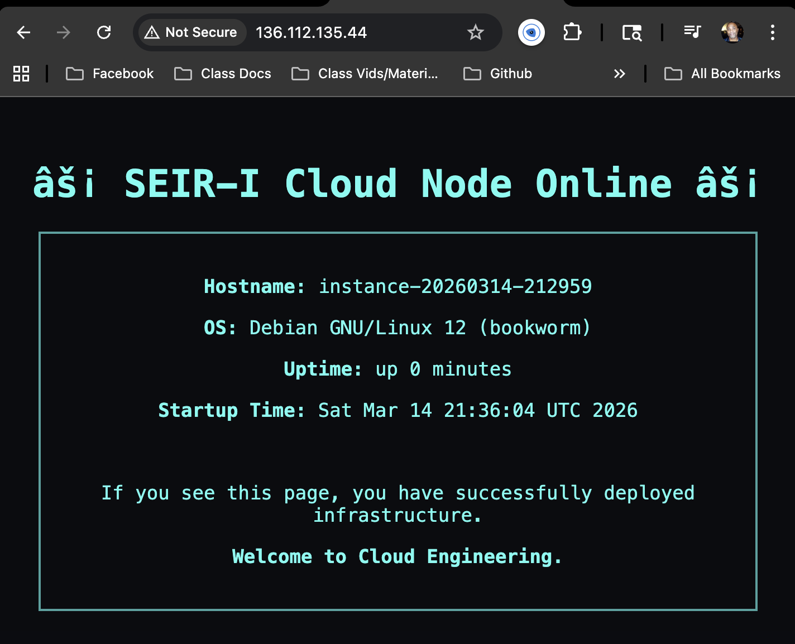

<sub>[Back to top](#table-of-contents)</sub>

---

# 6) Teardown 
- click instances and press delete


<sub>[Back to top](#table-of-contents)</sub>

---